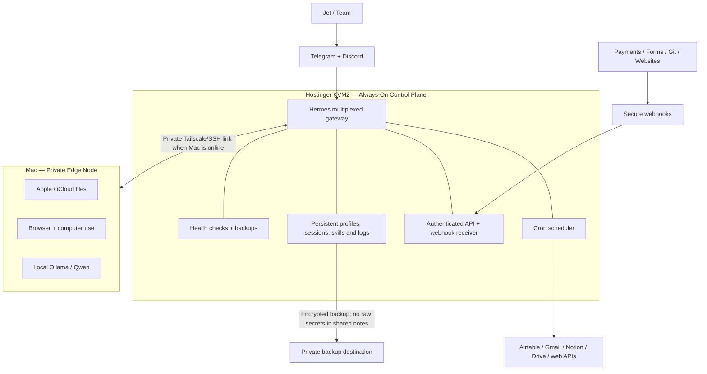

# Hostinger × Hermes: The Always-On Founder AI Operating System

> **Sponsor disclosure:** This use case is sponsored by Hostinger. Hostinger is providing the infrastructure featured here. The architecture, benefits, costs, and limitations below reflect how I would genuinely deploy Hermes; no invented uptime or savings claims are included.

## The one-sentence positioning

**Hostinger gives Hermes a permanent, always-on home, so the AI team can monitor, schedule, receive events, and report back even when the founder's laptop is closed.**

## The honest claim

You do **not** need a VPS to try Hermes. A laptop is the best place to install it, learn it, and build the first workflows.

You need an always-on server when Hermes stops being an experiment and starts owning operational responsibilities:

- scheduled founder briefings;
- revenue and payment alerts;
- important-email checks;
- website and automation watchdogs;
- webhook-triggered workflows;
- research and content pipelines;
- persistent Telegram and Discord access.

A laptop sleeps, travels, changes Wi-Fi, restarts, and gets used for other work. A VPS separates the founder's workstation from the infrastructure that should remain available.

## Why this is real for our workflow

Our live Hermes installation currently contains **14 profiles** and **32 active schedules** across the fleet. The public-facing business roles are:

- **Kelly** — chief of staff, operations, morning/evening briefs, revenue visibility;
- **Signal** — AI and business research;
- **Blaze** — English content;
- **Kaijeaw** — Thai content;
- **Bolt** — websites, apps, technical automations, and watchdogs;
- **Oracle** — pipeline and project orchestration;
- **Qwen** — local/private batch work and memory hygiene.

Hermes profiles are truly separate agents: each profile has its own configuration, credentials, personality, sessions, memory, skills, cron jobs, and state database.[4] Hermes can also operate several low-traffic profiles through one multiplexed gateway—specifically useful for a container or VPS where one process per profile is unnecessarily heavy.[5]

## The right architecture: VPS control plane + Mac edge node

Hermes officially supports local, Docker, and SSH execution backends, so this hybrid split is native to the platform rather than a workaround.[1] The official Docker image keeps configuration, sessions, skills, memories, and keys in a mounted persistent data directory; the gateway can run with restart supervision, while the optional API server and dashboard remain separate controlled surfaces.[2]

### Hostinger VPS owns the always-on layer

Run these on Hostinger:

1. Telegram/Discord gateway and command routing.
2. Cron scheduler for cloud/API workflows.
3. Payment, lead, form, and deployment webhooks.
4. Website, gateway, cron, and integration watchdogs.
5. Lightweight business-agent profiles.
6. Operational logs and an authenticated dashboard.
7. Encrypted backup and recovery procedures.

Hermes cron supports recurring and one-shot jobs, attached skills, delivery to messaging platforms, and **no-agent mode**, where deterministic scripts run with zero LLM involvement.[8] This is important: checking a payment endpoint or pinging a website does not need an expensive model call.

### The Mac keeps device-specific work

Keep these local:

- Apple Notes, Apple-only apps, and iCloud-native file workflows;
- browser sessions tied to the personal Mac profile;
- computer-use automation;
- local Ollama/Qwen inference;
- large local media and private files;
- workflows currently hard-coded to local iCloud paths.

If the Mac is offline, the VPS still handles alerts, web APIs, messaging, and schedules. Mac-only tasks wait until the edge node is available. The sponsor story should never imply that renting a VPS magically makes Apple or local-browser workflows cloud-native.

## Why Hostinger KVM2 fits

Hostinger's current KVM2 listing provides **2 vCPU cores, 8 GB RAM, 100 GB NVMe storage, and 8 TB bandwidth**. The same official page lists weekly backups, firewall management, a 1 Gbps network, global data centers, and a public VPS API.[7]

That makes KVM2 a sensible **orchestration/control-plane starting point** for Hermes. It is not a GPU machine and should not be presented as a server for running large local language models. Model inference comes from existing subscriptions, external APIs, or the Mac/local inference node.

The Hostinger VPS and the AI model solve different problems:

| Layer | What we pay for | What it solves |
|---|---|---|
| Hostinger VPS | Fixed infrastructure | Availability, stable network endpoint, schedules, webhooks, gateway, logs |
| AI model/provider | Usage or subscription | Reasoning, writing, research, coding |
| Local Mac/Qwen | Existing hardware | Private local inference and device-specific workflows |

This is why the earlier idea of swapping the whole fleet to an expensive API model was not worthwhile—but using Hostinger still can be. **We are buying reliability, not replacing every model.**

## Three hero workflows to demonstrate

### Demo 1 — Founder command center that works with the laptop closed

**What happens:**

1. Kelly runs the 7:00 AM founder brief on Hostinger.
2. It reads cloud-based business inputs: revenue snapshot, priority email signals, website health, and pipeline items.
3. It sends one concise brief to Telegram.
4. During the day, deterministic payment checks and website monitors send alerts only when something changes.
5. At 9:30 PM, Kelly sends the shutdown brief.

**Proof moment:** close the laptop before the scheduled time and show the brief still arriving.

**Hostinger benefit shown:** persistent gateway + scheduler + stable cloud network.

### Demo 2 — Event-to-agent workflow

**What happens:**

1. A payment, lead form, Git deployment, or customer event sends a signed webhook to the VPS.
2. Hermes validates the route and wakes the appropriate profile.
3. Kelly summarizes the business implication; Bolt checks technical state; Oracle creates or updates the follow-up task.
4. Jet receives an approval request for any action that affects a customer, payment, publication, or production system.

Hermes exposes an authenticated OpenAI-compatible API surface with its full toolset and profile-aware routing.[9] It also provides a web dashboard for monitoring profile state, sessions, model usage, skills, configuration, and cron jobs.[6]

**Proof moment:** submit a demo form or send a test webhook and watch the agent response arrive in Telegram.

**Hostinger benefit shown:** a persistent public endpoint that a closed laptop cannot reliably provide.

### Demo 3 — Research-to-content pipeline with human approval

**What happens:**

1. Signal gathers high-signal business/AI research on schedule.
2. Oracle filters and routes selected ideas.
3. Blaze creates an English asset; Kaijeaw adapts the best idea for Thai audiences.
4. Drafts return to Telegram/Discord for approval.
5. Local/browser-dependent production can be delegated to the Mac when available.

**Proof moment:** start with one approved research item and show it move through three specialized agents into an approval-ready content package.

**Hostinger benefit shown:** the pipeline state and schedules continue independently of the creator's workstation.

## Security and operating boundaries

Hermes documents a defense-in-depth model covering user authorization, dangerous-command approvals, file-write safety, container isolation, credential filtering, cross-session isolation, and input sanitization.[3]

For this deployment:

- expose only required ports;
- prefer a private VPN for the dashboard and admin access;
- require authentication for every API/dashboard surface;
- store secrets only in protected environment/secret files—not shared memory or Git;
- keep destructive commands and external side effects behind approval;
- run unattended tool-loop hard stops;
- use firewall allowlists, automatic updates, health checks, and backups;
- separate production and demo profiles;
- never publish real customer data, tokens, internal prompts, or private sessions.

## Phase-one deployment: what should actually move

Do **not** clone all 14 profiles onto the VPS on day one.

Start with one Hermes gateway and three lightweight profiles:

1. **Kelly Cloud** — Telegram/Discord, morning brief, evening brief, payment/email alerts.
2. **Signal Cloud** — web/API research and low-noise monitoring.
3. **Bolt Cloud** — website, cron, and integration watchdogs.

Move five cloud-native jobs first:

- payment alert;
- founder morning brief;
- founder evening brief;
- important-email alert filter;
- website/mission-control health check.

Keep all iCloud, Apple, computer-use, and local-Qwen jobs on the Mac. After seven stable days, add the research-to-content and Oracle routing workflows.

## Success criteria for the sponsor demo

The demo is successful when we can show:

- the laptop is closed and Telegram still responds;
- a scheduled brief fires from the VPS;
- a test webhook reaches Hermes and routes correctly;
- a website/payment monitor sends only a meaningful alert;
- a dangerous or public action stops for human approval;
- the dashboard shows the real session/job state;
- a backup and restore procedure has been tested;
- model spend remains separately capped and observable.

Do not claim “24/7 uptime” until we have measured it. Say **always-on architecture** or **designed to remain available**.

## Sponsor-ready content angle

### Title

**I Put My AI Team on a $10–15 VPS—Now It Works When My Laptop Is Closed**

### Hook

> “AI agents are impressive on a laptop. But if they stop when you close the lid, they are still demos—not infrastructure.”

### Story beats

1. Show the current pain: the founder's laptop acting like a server.
2. Explain that the expensive API-model swap was the wrong problem.
3. Introduce Hostinger as the always-on control plane.
4. Deploy the Hermes Docker gateway and connect Telegram.
5. Add one brief, one alert, and one event-driven workflow.
6. Close the laptop.
7. Show the brief/webhook arriving.
8. Explain the hybrid split and approval boundaries.
9. Invite viewers to build their first three workflows.

### CTA

> “Start Hermes on your laptop. When the workflows become important enough that they must not stop with your laptop, move the always-on layer to a Hostinger VPS. Use the sponsor link to build your own founder AI operating system.”

## Claims to avoid

- “Hostinger makes the AI smarter.”
- “The VPS eliminates AI API costs.”
- “KVM2 can run any local LLM.”
- “This fully replaces employees.”
- “Everything works without maintenance.”
- “Your data is automatically private because it is self-hosted.”
- Any uptime, savings, speed, or revenue number we have not measured.

## Next production artifacts

From this use case we can create:

1. a 6–8 minute YouTube integration;
2. a 60–90 second sponsor segment;
3. a 9-slide Instagram carousel;
4. a technical tutorial/runbook;
5. a downloadable “Always-On Hermes VPS Checklist.”

## Sources

[1] https://hermes-agent.nousresearch.com/docs/llms.txt — Hermes Agent Documentation Index
[2] https://hermes-agent.nousresearch.com/docs/user-guide/docker — Hermes Agent Docker Guide
[3] https://hermes-agent.nousresearch.com/docs/user-guide/security — Hermes Agent Security
[4] https://hermes-agent.nousresearch.com/docs/user-guide/profiles — Hermes Agent Profiles
[5] https://hermes-agent.nousresearch.com/docs/user-guide/multi-profile-gateways — Hermes Multi-Profile Gateways
[6] https://hermes-agent.nousresearch.com/docs/user-guide/features/web-dashboard — Hermes Web Dashboard
[7] https://www.hostinger.com/vps-hosting — Hostinger VPS Hosting
[8] https://hermes-agent.nousresearch.com/docs/user-guide/features/cron — Hermes Cron Jobs
[9] https://hermes-agent.nousresearch.com/docs/user-guide/features/api-server — Hermes API Server
